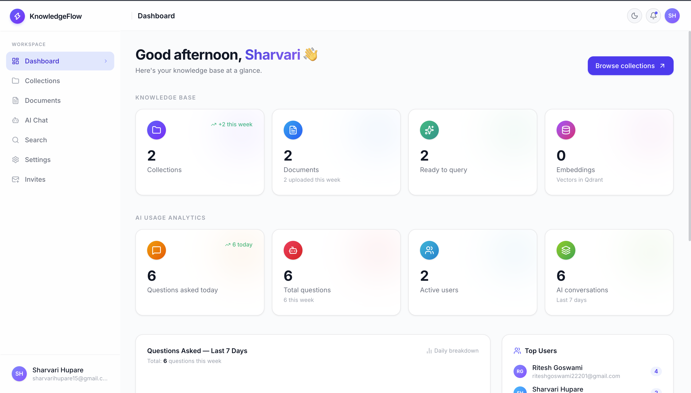
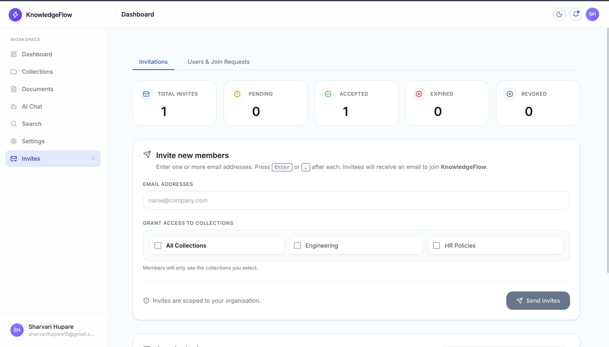
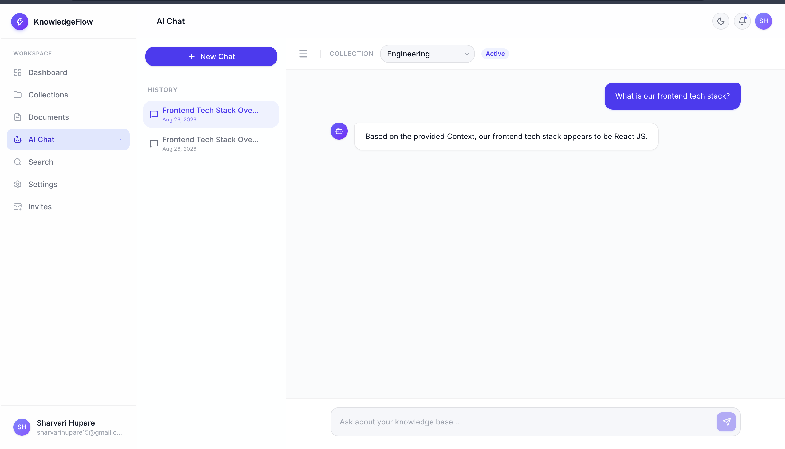

# KnowledgeFlow

KnowledgeFlow is an AI-powered full-stack application that enables users to parse, store, and intelligently query their documents. Leveraging Retrieval-Augmented Generation (RAG), it allows you to upload PDFs and interact with your data using large language models via NVIDIA, OpenAI, or locally using Ollama.

## 🚀 Live Demo & Screenshots

> **Note:** Add your live website images here.








## ✨ Features

- **Document Parsing:** Upload and extract text from PDF documents.
- **Vector Search:** Store document embeddings in a Qdrant vector database for fast, context-aware semantic search.
- **AI Integration:** Query your documents using powerful LLMs through OpenAI, NVIDIA, or run models locally on your machine via Ollama.
- **Modern UI:** Responsive, accessible, and animated frontend built with Next.js, Tailwind CSS v4, and Framer Motion.
- **Secure Authentication:** User authentication powered by JWT and bcrypt.

## 🛠️ Tech Stack

### Frontend
- **Framework:** [Next.js](https://nextjs.org/) (React)
- **Styling:** [Tailwind CSS](https://tailwindcss.com/)
- **Animations:** [Framer Motion](https://www.framer.com/motion/)
- **Data Fetching:** [React Query](https://tanstack.com/query/latest) & [Axios](https://axios-http.com/)
- **Components/UI:** React Markdown, Lucide Icons

### Backend
- **Server:** [Node.js](https://nodejs.org/) & [Express](https://expressjs.com/) (TypeScript)
- **Database (Relational):** [PostgreSQL](https://www.postgresql.org/) with [Prisma ORM](https://www.prisma.io/)
- **Database (Vector):** [Qdrant](https://qdrant.tech/)
- **AI/ML:** [NVIDIA](https://build.nvidia.com/), [OpenAI API](https://openai.com/), [Ollama](https://ollama.com/) (Local Models)
- **File Processing:** Multer, PDF-Parse

## 📂 Project Structure

```text
knowledgeflow/
├── client/                 # Next.js frontend application
├── server/                 # Express backend API & AI integration
├── qdrant_storage/         # Local Qdrant vector database storage
└── docker-compose.yml      # Docker configuration for dependencies (Postgres, Qdrant)
```

## 🚀 Getting Started

### Prerequisites

Ensure you have the following installed on your local machine:
- [Node.js](https://nodejs.org/) (v20 or higher recommended)
- [Docker](https://www.docker.com/) & Docker Compose
- [NVIDIA Developer Account](https://build.nvidia.com/) (Optional, if using NVIDIA models)
- [Ollama](https://ollama.com/) (Optional, for running LLMs locally on your machine)

### Installation

1. **Clone the repository:**
   ```bash
   git clone <your-repository-url>
   cd knowledgeflow
   ```

2. **Setup the Backend:**
   ```bash
   cd server
   npm install
   ```
   *Note: Ensure you configure your `.env` file in the `server` directory with your database credentials, OpenAI keys, JWT secrets, etc.*

3. **Setup the Frontend:**
   ```bash
   cd ../client
   npm install
   ```
